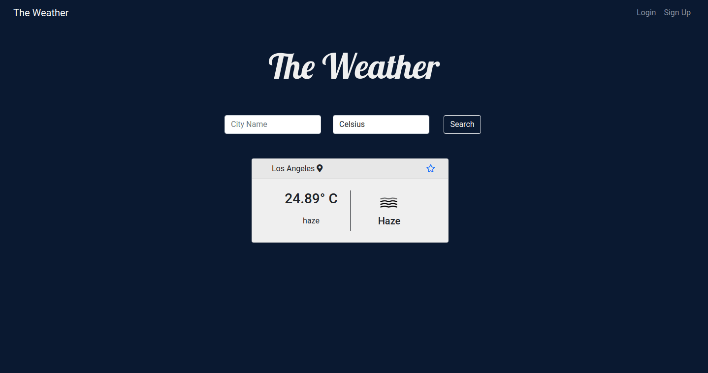

# django-weather
Weather app made with Django framework using the OpenWeatherMap API and Geo localization with GeoIP2.

You can access the ap at: https://the-weather-django.herokuapp.com/

## The Weather


## Fatures
- [x] Geo Localization usin GeoIP2 city database
- [x] User Registration
- [x] User authentication
- [x] Aunthenticated users can save cities to show up in it's home page
- [x] Consume the OpenWeatherMap Api

## Built with
- [Python 3](https://www.python.org/)
- [Django](https://www.djangoproject.com/)
- [HTML5](https://dev.w3.org/html5/html-author/)
- [CSS](https://devdocs.io/css/)
- [Bootstrap](https://getbootstrap.com/)
- [OpenWeatherMap](https://openweathermap.org/)

## Setup
First clone the repository from Github and switch to the new directory:

    $ git clone git@github.com:rafaellima47/django-weather.git
    $ cd django-weather
    
Activate the virtualenv for your project.
    
Install project dependencies:

    $ pip install -r requirements.txt
    
    
Apply the migrations:

    $ python manage.py migrate


Download the binaries of 'GeoLite2-city.mmdb' at https://dev.maxmind.com/geoip/geolite2-free-geolocation-data and Add it to the geoip directory:

    $ ls geoip/
    GeoLite2-City.mmdb


Signup and get your API key at https://openweathermap.org/api

Them assign your key to the variable API_KEY in config.py

```python
API_KEY = "your_api_key"
```


You can now run the development server:

    $ python manage.py runserver
